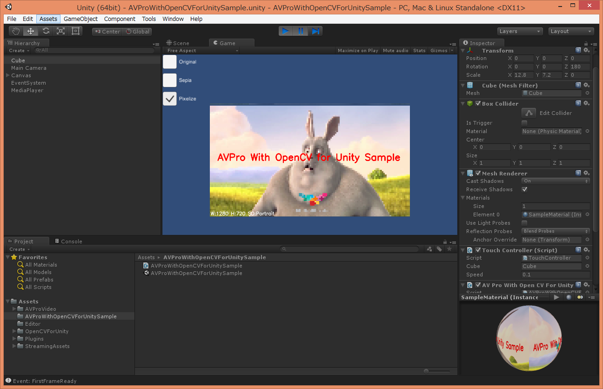

AVPro With OpenCV for Unity Example
====================

Overview
-----
This example shows how to convert AVProVideo and AVProLiveCamera texture to OpenCV Mat using AsyncGPUReadback.
- AVProVideoGetReadableTextureExample
- AVProVideoAsyncGPUReadbackExample
- AVProVideoExtractFrameExample
- AVProLiveCameraGetFrameAsColor32Example
- AVProLiveCameraAsyncGPUReadbackExample

Environment
-----
- Unity 2020.3.48f1+
- [OpenCVForUnity](https://assetstore.unity.com/packages/tools/integration/opencv-for-unity-21088?aid=1011l4ehR) 2.5.9+
- [UnityPlugin-AVProVideo](https://assetstore.unity.com/packages/tools/video/avpro-video-v3-core-desktop-edition-278895?aid=1011l4ehR) 2.9.3+ (Latest-Trial)
- [UnityPlugin-AVProLiveCamera](https://assetstore.unity.com/packages/tools/video/avpro-live-camera-3683?aid=1011l4ehR) 2.9.3+  (Latest-Trial)

Setup
-----
1. Download the latest release unitypackage. [AVProWithOpenCVForUnityExample.unitypackage](https://github.com/EnoxSoftware/AVProWithOpenCVForUnityExample/releases)
1. Create New Project. (AVProWithOpenCVForUnityExample)
1. Import OpenCVForUnity from AssetStore
1. Import UnityPlugin-AVProVideo-Latest-Trial.unitypackage
1. Import UnityPlugin-AVProLiveCamera-Latest-Trial.unitypackage
1. Import AVProWithOpenCVForUnityExample.unitypackage
1. Add the "Assets/AVProWithOpenCVForUnityExample/*.unity" files to the "Scenes In Build" list in the "Build Settings" window.
1. Build and Deploy.

Screen Shot
-----

