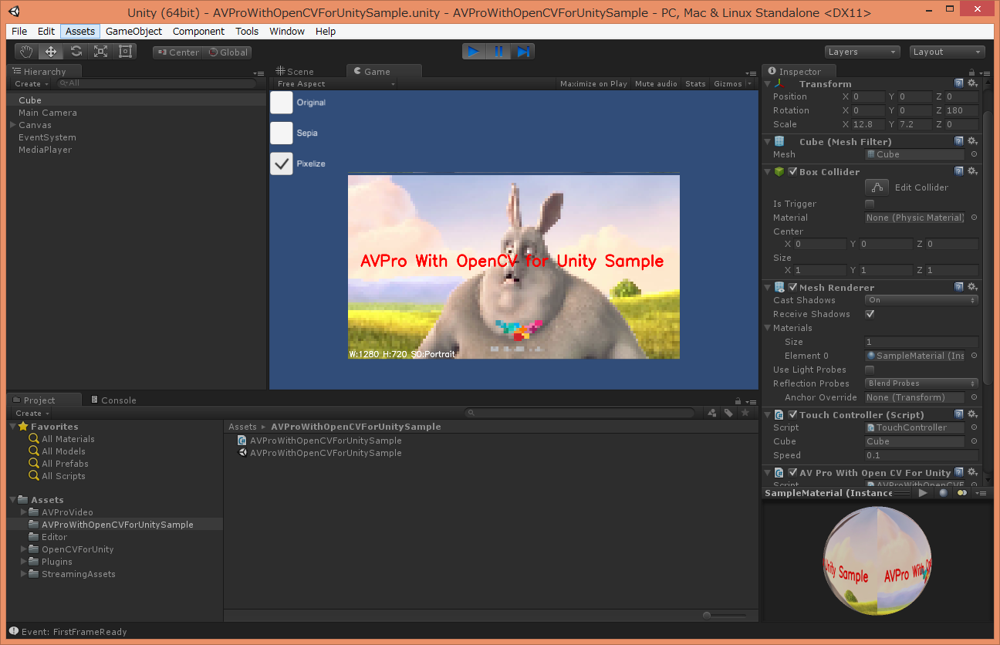

# AVPro With OpenCV for Unity Example

## Overview

- Integrate **[AVPro Video](https://assetstore.unity.com/packages/tools/video/avpro-video-v3-core-desktop-edition-278895?aid=1011l4ehR)** and **[AVPro Live Camera](https://assetstore.unity.com/packages/tools/video/avpro-live-camera-3683?aid=1011l4ehR)** with **[OpenCV for Unity](https://assetstore.unity.com/packages/tools/integration/opencv-for-unity-21088?aid=1011l4ehR)**.
- Convert **AVPro Video** and **AVPro Live Camera** textures to **OpenCV**'s `Mat` class using `AsyncGPUReadback`.
- Example scenes:
  - `AVProVideoGetReadableTextureExample`
  - `AVProVideoAsyncGPUReadbackToMatHelperExample`
  - `AVProVideoExtractFrameExample`
  - `AVProLiveCameraGetFrameAsColor32Example`
  - `AVProLiveCameraAsyncGPUReadbackToMatHelperExample`

## Environment

- **Unity 2022.3.62f3+**
- [OpenCV for Unity](https://assetstore.unity.com/packages/tools/integration/opencv-for-unity-21088?aid=1011l4ehR) **3.0.4+**
- [UnityPlugin-AVProVideo](https://assetstore.unity.com/packages/tools/video/avpro-video-v3-core-desktop-edition-278895?aid=1011l4ehR) **3.4.2+** *(Latest-Trial)*
- [UnityPlugin-AVProLiveCamera](https://assetstore.unity.com/packages/tools/video/avpro-live-camera-3683?aid=1011l4ehR) **2.9.3+** *(Latest-Trial)*

## Setup

1. Download the latest release unitypackage from [AVProWithOpenCVForUnityExample.unitypackage](https://github.com/EnoxSoftware/AVProWithOpenCVForUnityExample/releases).
2. Create a new project. *(ex. AVProWithOpenCVForUnityExample)*
3. Import [OpenCV for Unity](https://assetstore.unity.com/packages/tools/integration/opencv-for-unity-21088?aid=1011l4ehR) from the Asset Store.
4. Import `UnityPlugin-AVProVideo-vX.X.X-Trial.unitypackage`.
5. Import `UnityPlugin-AVProLiveCamera-vX.X.X-Trial.unitypackage`.
6. Import [AVProWithOpenCVForUnityExample.unitypackage](https://github.com/EnoxSoftware/AVProWithOpenCVForUnityExample/releases).
7. Add all of the `***.unity` files in the `AVProWithOpenCVForUnityExample` folder to `Build Settings` → `Scenes In Build`.
8. Build and Deploy.

## ScreenShot

